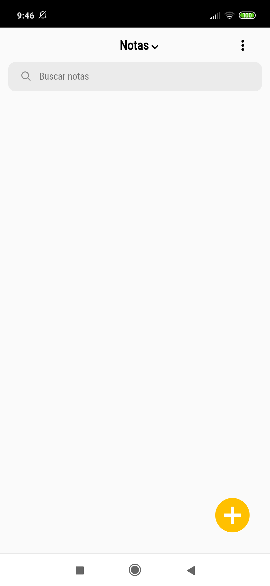
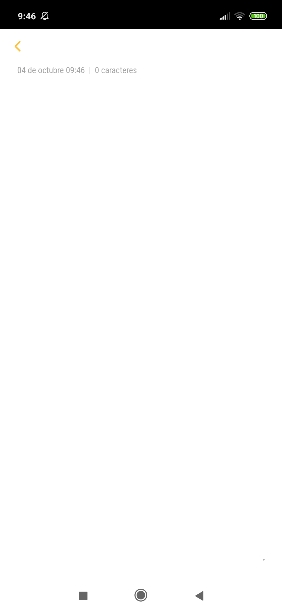
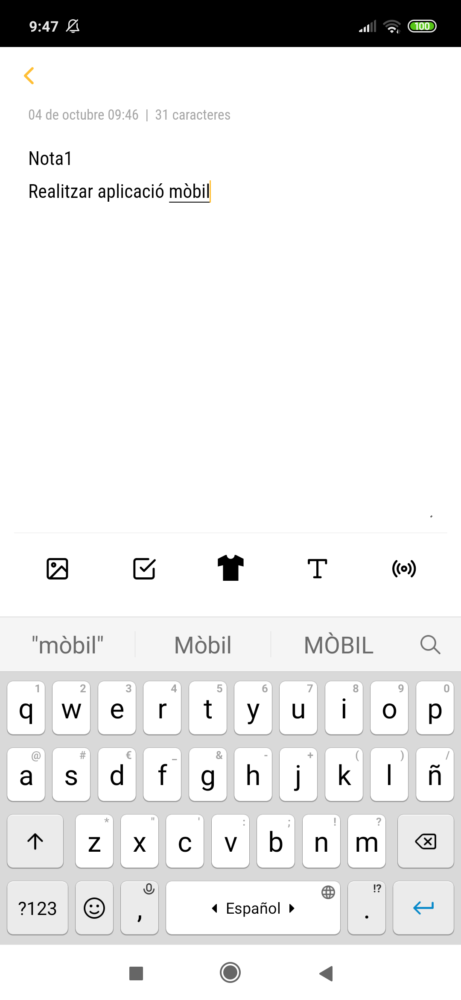
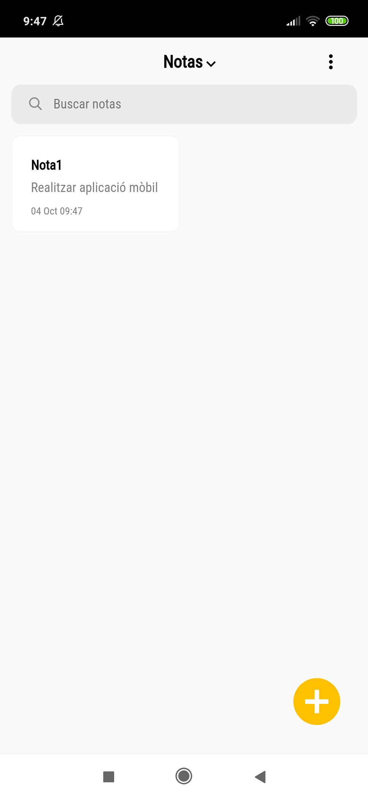
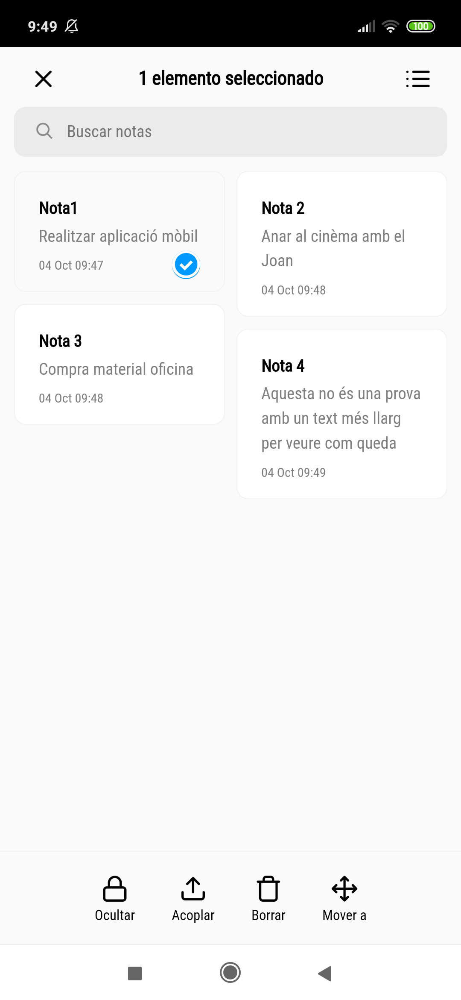
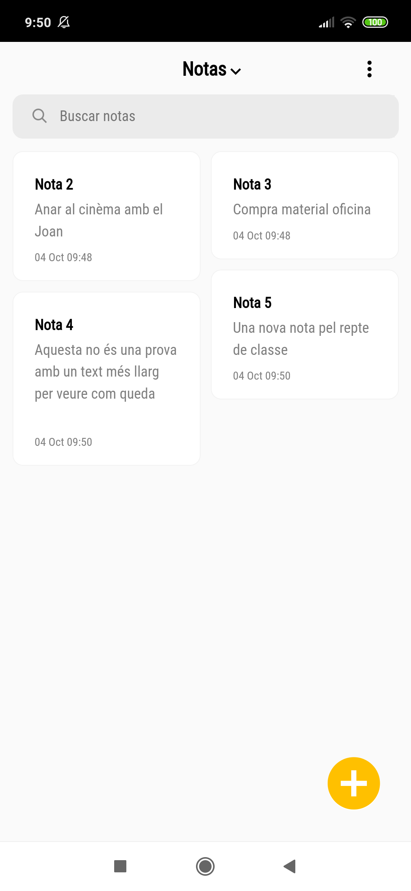

<div align="center">
  <a href="https://www.fontspace.com/category/handwriting"></a>
  
  <a href="#"></a>
  <a href="#"></a>
  <a href="#"></a>
</div>

<br>

## Objectiu del Repte
Aquest repte consisteix en desenvolupar una aplicació de bloc de notes, clonant la funcionalitat de l'aplicació Notas d'Android. L'objectiu és crear una interfície que permeti als usuaris crear, editar, esborrar i seleccionar notes de manera senzilla. A més, la informació de les notes es guardarà localment en el navegador, utilitzant el `localStorage`, per garantir que les notes persistin fins i tot després de tancar o actualitzar la pàgina.

Per conèixer l'aparença a dissenyar seguirem la guia de la presentació amb les imatges a continuació, que detallen la interfície de l'aplicació, la seva funcionalitat i el seu aspecte visual.

<br>

## Imatges de referència
<div align="center">
  
  
  
  
  
  
</div>

## Funcionalitats Principals
- **Crear Notes**: Permet crear noves notes amb un títol i un contingut personalitzat.
- **Editar Notes**: Al fer clic sobre una nota, s'obre un editor per actualitzar el seu contingut.
- **Esborrar Notes**: Les notes es poden esborrar amb un simple clic.
- **Seleccionar Notes**: Les notes es poden seleccionar per realitzar accions com editar o esborrar.
- **Emmagatzematge Local**: Les notes es guarden en `localStorage`, permetent mantenir-les fins i tot després de tancar o actualitzar la pàgina.

<br>

## Instal·lació i Execució
1. **Descarregar o Clonar el Repositori**: Pots descarregar o clonar aquest repositori per utilitzar-lo localment.
   - Per descarregar el repositori, utilitza el botó de "Download ZIP" a GitHub.
   - O bé, pots clonar-lo amb la següent comanda de Git:
     ```bash
     git clone https://github.com/Sailok25/Repte-4_Bloc-de-Notes.git
     ```
2. **Obrir l'Arxiu HTML**: Un cop descarregat, simplement obre el fitxer `index.html` en qualsevol navegador modern per començar a utilitzar el bloc de notes.
